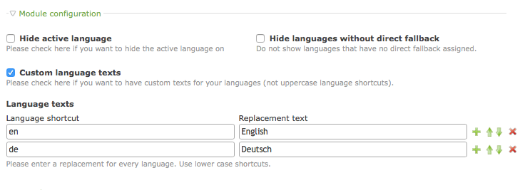

# ChangeLanguage v3

1. [Installation](installation.md)
2. [Linking pages](pages.md)
3. [Frontend module](frontend-module.md)
4. [Insert tags](inserttags.md)
5. [Tips & FAQ](tips-faq.md)

## Front end module

To add *ChangeLanguage* to your website, go to your website theme and add a new
module of type *Change Language*. Place this module in your page layout to
make it available to visitors.

### Configuration options

The front end module can be configured to your needs with several options.

#### Hide active language

If this flag is enabled, the currently active language will not be shown
in the front end. As an example, if your website is available in german and
english, and the visitor is currently on a german page, only a link to
english will be shown. By default *ChangeLanguage* will also show the
current language (as an inactive navigation item).

#### Hide languages without direct fallback

If you enable this option, a language option will be hidden if there is no
equvalent (= linked) page in the page tree.

Be aware that this also affects modules on your page. If the user is viewing
a news item, and the news item is not available in the other language(s), the
navigation item will be removed.

#### Language texts

By default, *ChangeLanguage* will show the language selection with uppercase
versions of the language set in each root page. To customize the labels, enable
this option and enter each language shortcut (e.g. "de" or "de-CH") and the
desired replacement in the input wizard.
